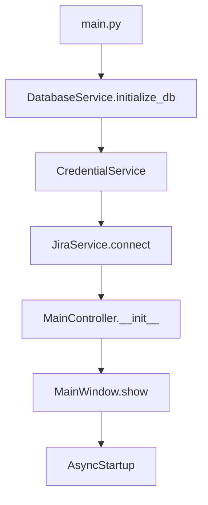
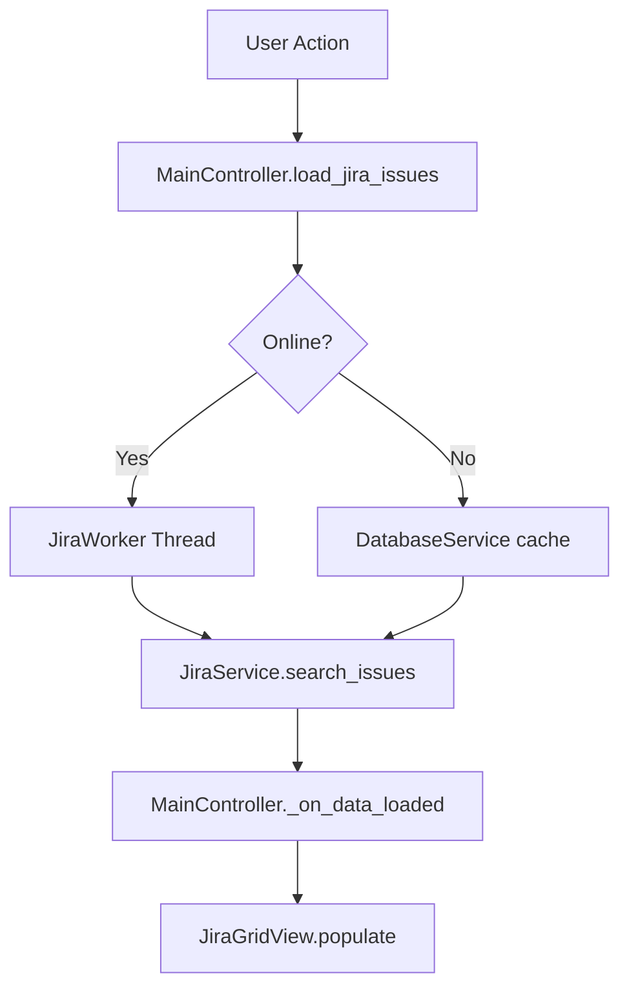
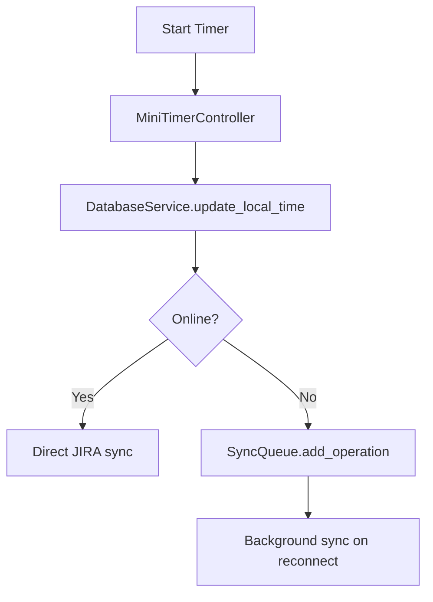

# 🏗️ Architettura Generale - Jira Timer Tracker

## 📋 Panoramica del Sistema

Il **Jira Timer Tracker** è un'applicazione desktop sviluppata in Python con PyQt6 che implementa un sistema completo per il tracking del tempo su ticket JIRA con gestione offline avanzata.

## 🎯 Funzionalità Principali

### Core Features
1. **Timer Tracking**: Tracciamento tempo sui ticket JIRA con sincronizzazione
2. **Gestione Note**: Sistema completo di annotazioni con versioning Git
3. **Modalità Offline**: Funzionamento completo senza connessione internet
4. **Sync Queue**: Sistema di sincronizzazione differita per operazioni offline
5. **Attachment Management**: Download e gestione allegati JIRA
6. **Network Monitoring**: Monitoraggio automatico stato connessione

### UI Features
1. **Griglia JIRA**: Visualizzazione ticket con filtri e ricerca
2. **Detail View**: Vista dettagliata ticket con editor note tabbed
3. **Mini Widget**: Widget ridotto per timing rapido
4. **History View**: Cronologia visualizzazioni ticket
5. **Configuration**: Gestione completa impostazioni

## 🏛️ Pattern Architetturali

### 1. **Model-View-Controller (MVC)**
```
Views/ ────────► Controllers/ ────────► Services/
   │                 │                    │
   │                 │                    │
   └─── PyQt6 UI ────┼─── Logic ─────────┴─── Data/API
```

### 2. **Service Layer Pattern**
- **DatabaseService**: Gestione database SQLite locale
- **JiraService**: Interazione API JIRA con retry logic
- **AttachmentService**: Gestione file e download
- **NetworkService**: Monitoraggio connessione
- **CredentialService**: Gestione sicura credenziali

### 3. **Observer Pattern** 
- Segnali PyQt6 per comunicazione asincrona
- Event-driven architecture per UI responsiva

### 4. **Thread Pool Pattern**
- Worker threads per operazioni I/O
- Background processing per sync operations

## 📂 Struttura Directory

```
progetto jira timer tracker/
├── main.py                     # Entry point applicazione
├── requirements.txt            # Dipendenze Python
├── documentazione/             # 📚 DOCUMENTAZIONE CENTRALIZZATA
│   ├── 01_ARCHITETTURA_GENERALE.md
│   ├── 02_SERVIZI_CORE.md
│   ├── 03_CONTROLLERS_LOGICA.md
│   ├── 04_VIEWS_INTERFACCIA.md
│   ├── 05_DATABASE_SCHEMA.md
│   ├── 06_API_REFERENCE.md
│   └── 99_REFACTORING_ROADMAP.md
├── controllers/                # 🎮 Logica Business
│   ├── main_controller.py      # Controller principale
│   ├── jira_detail_controller.py
│   ├── config_controller.py
│   ├── attachment_controller.py
│   └── [altri controllers]
├── views/                      # 🖼️ Interfaccia Utente
│   ├── main_window.py          # Finestra principale
│   ├── jira_detail_view.py     # Vista dettaglio ticket
│   ├── config_dialog.py        # Dialog configurazione
│   ├── notes_manager_dialog.py # Gestore note avanzato
│   └── [altre views]
├── services/                   # ⚙️ Servizi Core
│   ├── db_service.py          # Database SQLite
│   ├── jira_service.py        # API JIRA
│   ├── attachment_service.py   # Gestione file
│   ├── network_service.py     # Monitoraggio rete
│   ├── credential_service.py  # Sicurezza credenziali
│   └── git_service.py         # Versioning note
├── workers/                   # 🔄 Background Processing
│   ├── worker.py              # Thread workers generici
│   └── sync_worker.py         # Sincronizzazione
├── assets/                    # 🎨 Risorse statiche
├── qfluentwidgets/           # 🎨 UI Framework custom
└── tests/                    # 🧪 Test suite
```

## 🔄 Flusso di Dati

### 1. **Avvio Applicazione**


### 2. **Caricamento Ticket**


### 3. **Timer Tracking**


## 🔧 Tecnologie e Framework

### Core Stack
- **Python 3.12+**: Linguaggio base
- **PyQt6**: Framework UI desktop
- **SQLite**: Database locale embedded
- **JIRA Python Library**: API client
- **Keyring**: Gestione sicura credenziali
- **QFluentWidgets**: UI components avanzati

### Dipendenze Principali
```python
# UI Framework
PyQt6>=6.4.0
qfluentwidgets>=1.1.0

# API & Network
jira>=3.4.0
requests>=2.28.0

# Database & Storage
sqlite3 (built-in)
keyring>=23.0.0

# Development
pytest>=7.0.0
black>=22.0.0
```

## 📊 Metriche Performance

### Database
- **Tables**: 15 tabelle principali
- **Indices**: Ottimizzati per query frequenti
- **Size**: ~50MB per 10K tickets con allegati

### Memory Usage
- **Base**: ~80MB all'avvio
- **Peak**: ~200MB con 1000+ ticket caricati
- **Cache**: Intelligente con LRU eviction

### Network Efficiency
- **Batch Operations**: Request batching per API
- **Retry Logic**: Exponential backoff
- **Offline Mode**: Completo funzionamento senza rete

## 🚀 Punti di Forza

1. **Robustezza Offline**: Funzionamento completo senza connessione
2. **Performance**: UI responsiva con threading asincrono
3. **Sicurezza**: Credenziali cifrate nel keyring OS
4. **Scalabilità**: Architettura modulare estendibile
5. **UX**: Interface fluida con feedback visivo

## ⚠️ Aree di Miglioramento

1. **Testing Coverage**: Aumentare copertura test automatici
2. **Logging**: Centralizzare e strutturare logging
3. **Configuration**: Sistema configurazione più flessibile  
4. **Plugin Architecture**: Supporto estensioni modulari
5. **Documentation**: API documentation completa

## 🔮 Roadmap Evolutiva

### Short Term (1-2 mesi)
- Refactoring gestione note con file system
- Fix dropdown JQL
- Miglioramento sistema async startup

### Medium Term (3-6 mesi)  
- Plugin system per estensioni
- Advanced reporting features
- Multi-workspace support

### Long Term (6+ mesi)
- Web version con Electron
- Mobile companion app
- AI-powered time estimation

---

## 📝 Note per Sviluppatori AI

Questa architettura è progettata per essere:
- **Modulare**: Ogni componente ha responsabilità ben definite
- **Testabile**: Dipendenze iniettabili e mockable  
- **Estendibile**: Pattern consistenti per nuove feature
- **Mantenibile**: Separation of concerns chiara

Consultare sempre questa documentazione prima di modifiche sostanziali.