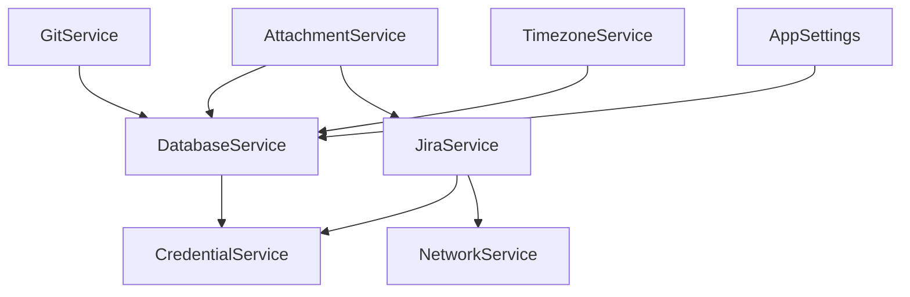

# ⚙️ Servizi Core - Jira Timer Tracker

## 📋 Overview Layer di Servizi

I servizi rappresentano il layer di accesso ai dati e alle API esterne. Ogni servizio ha una responsabilità specifica e mantiene l'isolamento delle dipendenze.

## 🗄️ DatabaseService

### Responsabilità
- Gestione schema SQLite locale
- CRUD operations per tutte le entità
- Transazioni e consistenza dati
- Cache management per performance

### Tabelle Principali
```sql
-- Tracking tempo locale
LocalTimeLog (JiraKey, SecondsTracked, StartTime)

-- Storia attività
LocalWorklogHistory (Id, JiraKey, StartTime, DurationSeconds, Comment, Task)

-- Cache issue JIRA
JiraIssueCache (JiraKey, Summary, Status, Priority, CachedAt, UpdatedAt)

-- Gestione note con versioning
Annotations (Id, JiraKey, Title, Content, IsDraft, Tags, CreatedAt, UpdatedAt)

-- Cronologia visualizzazioni
ViewHistory (JiraKey, LastViewedAt)

-- Preferiti utente
Favorites (JiraKey)

-- Notifiche
Notifications (Id, JiraKey, Type, Message, IsRead, CreatedAt)

-- Coda sincronizzazione
SyncQueue (Id, OperationType, Payload, Status, Attempts, ErrorMessage)

-- Allegati scaricati
FileAttachments (Id, JiraKey, AttachmentId, FileName, FilePath, FileHash)
```

### Metodi Principali
```python
# Time Tracking
def update_local_time(jira_key: str, seconds: int, start_time)
def get_local_time(jira_key: str) -> int
def reset_local_time(jira_key: str)

# Issue Cache
def save_jira_issue(jira_key: str, summary: str, status: str, priority: str)
def get_jira_issue(jira_key: str) -> dict
def get_recent_issues(limit: int = 20) -> list

# Notes Management
def save_annotation(jira_key: str, title: str, content: str, tags: str = None)
def get_annotations(jira_key: str) -> list
def delete_annotation(annotation_id: int)

# Sync Queue
def add_to_sync_queue(operation_type: str, payload: str)
def get_pending_sync_operations() -> list
def mark_sync_operation_completed(operation_id: int)
```

### Performance Optimizations
- Connection pooling per thread safety
- Prepared statements per query frequenti  
- Indices su colonne ricercate spesso
- Batch operations per inserimenti multipli

---

## 🌐 JiraService

### Responsabilità
- Autenticazione e connessione API JIRA
- Operazioni CRUD su issue, commenti, worklogs
- Retry logic con exponential backoff
- Rate limiting e error handling

### Configurazione Retry Logic
```python
# Retry Settings
max_retries: int = 3
base_retry_delay: float = 0.5  # secondi
max_delay: float = 30.0        # cap massimo
non_retryable_statuses: list = [400, 401, 403, 404]  # HTTP codes
```

### API Endpoints Utilizzati
```python
# Issue Operations
GET /rest/api/2/issue/{issueKey}
GET /rest/api/2/search?jql=...
POST /rest/api/2/issue/{issueKey}/worklog

# Comments
GET /rest/api/2/issue/{issueKey}/comment
POST /rest/api/2/issue/{issueKey}/comment

# Attachments  
GET /rest/api/2/issue/{issueKey}/attachments
POST /rest/api/2/issue/{issueKey}/attachments

# User Info
GET /rest/api/2/myself
GET /rest/api/2/serverInfo
```

### Metodi Core
```python
def connect(server_url: str, pat: str) -> bool
def is_connected() -> bool
def search_issues(jql: str, start_at: int = 0, max_results: int = 100) -> dict
def get_issue(issue_key: str) -> dict
def add_worklog(issue_key: str, time_spent: str, comment: str = None)
def add_comment(issue_key: str, body: str)
def get_issue_comments(issue_key: str) -> list
```

### Error Handling Strategy
1. **Network Errors**: Auto-retry con backoff
2. **Auth Errors**: Immediate failure, no retry
3. **Rate Limiting**: Adaptive delay based on headers
4. **Server Errors**: Retry con exponential backoff

---

## 🔐 CredentialService

### Responsabilità
- Storage sicuro credenziali nel keyring OS
- Encryption/decryption PAT tokens
- Multi-account support per diversi server JIRA

### Security Features
- Utilizza keyring nativo OS (Windows Credential Manager, macOS Keychain, Linux Secret Service)
- PAT tokens mai memorizzati in plain text
- Service isolation per server diversi

### API Methods
```python
def set_pat(jira_url: str, pat: str)
def get_pat(jira_url: str) -> str | None  
def delete_pat(jira_url: str)
def list_stored_servers() -> list[str]
```

---

## 📎 AttachmentService

### Responsabilità
- Download automatico allegati JIRA
- Gestione cache locale file
- Verifica integrità con hash SHA-256
- Cleanup file orfani

### Storage Structure
```
attachments/
├── JIRA-123/
│   ├── attachment_456_document.pdf
│   ├── attachment_789_image.png
│   └── .metadata.json
└── PROJ-456/
    └── attachment_321_spreadsheet.xlsx
```

### Hash Management
- **SHA-256** per verifica integrità
- Rilevamento modifiche server-side
- Re-download automatico se hash cambiato

### Core Operations
```python
async def download_attachment(jira_key: str, attachment_info: dict) -> str
def check_attachment_exists(jira_key: str, attachment_id: str) -> tuple[bool, dict]
def get_attachment_path(jira_key: str, attachment_id: str, file_name: str) -> str
def delete_attachment(jira_key: str, attachment_id: str) -> bool
```

---

## 🌐 NetworkService

### Responsabilità
- Monitoraggio stato connessione internet
- Rilevamento availability server JIRA  
- Auto-reconnect quando possibile
- Signal emission per state changes

### Monitoring Strategy
```python
# DNS Test Hosts (fallback chain)
PRIMARY: 8.8.8.8:53      # Google DNS
SECONDARY: 1.1.1.1:53    # Cloudflare DNS  
TERTIARY: local_gateway  # Router locale
```

### Connection States
- **Internet Available**: Connessione internet OK
- **JIRA Available**: Server JIRA raggiungibile  
- **Full Offline**: Nessuna connessione
- **Partial**: Internet OK ma JIRA down

### Signals Emitted
```python
connection_changed = pyqtSignal(bool)      # Internet status
jira_connection_changed = pyqtSignal(bool) # JIRA status  
```

---

## 🕒 TimezoneService

### Responsabilità
- Conversione timestamp UTC ↔ Local
- Gestione fusi orari utente
- Formattazione date localizzate

### Core Methods
```python
def get_local_time(utc_time: datetime) -> datetime
def get_utc_time(local_time: datetime) -> datetime  
def format_local_time(utc_time: datetime, format: str) -> str
def get_timezone_name() -> str
```

---

## 📝 GitService (Sistema Note Avanzato)

### Responsabilità
- Versioning automatico delle note
- History tracking modifiche
- Branch management per draft/commit
- Integration con sistema note

### Git Operations
```python
def init_repository(repo_path: str) -> bool
def commit_changes(message: str, files: list) -> str
def get_file_history(file_path: str) -> list
def create_branch(branch_name: str) -> bool
def merge_branch(source: str, target: str) -> bool
```

### Note Versioning Workflow
1. **Draft**: Note modificabili in working directory
2. **Staged**: Note pronte per commit  
3. **Committed**: Note versionate in Git history

---

## 🔄 AppSettings

### Responsabilità
- Persistenza configurazione applicazione
- QSettings wrapper con type safety
- Default values management
- Settings validation

### Configuration Categories
```python
# Jira Connection
jira/url: str
jira/max_retries: int
jira/timeout: float

# UI Preferences  
ui/always_on_top: bool
ui/theme: str
ui/window_geometry: str

# Performance
performance/cache_size: int
performance/sync_interval: int
performance/background_sync: bool
```

---

## 📊 Service Dependencies



## 🔧 Service Lifecycle

### Initialization Order
1. **AppSettings** - Prima di tutto per configurazione
2. **DatabaseService** - Schema e connessioni
3. **CredentialService** - Accesso sicuro credenziali
4. **NetworkService** - Monitoring connessione  
5. **JiraService** - Connessione API
6. **AttachmentService** - Dipende da DB + JIRA
7. **GitService** - Sistema versioning note

### Shutdown Sequence
1. Stop all background threads
2. Flush pending database operations
3. Close network connections
4. Clean up temporary files
5. Save application state

---

## 🚨 Error Handling Strategy

### Service-Level Errors
- **Database**: Transaction rollback, connection recovery
- **Network**: Retry logic, graceful degradation
- **JIRA API**: Status code handling, rate limiting
- **File System**: Permission checks, disk space validation

### Error Propagation
```python
# Custom Exception Hierarchy
class ServiceError(Exception): pass
class DatabaseError(ServiceError): pass  
class NetworkError(ServiceError): pass
class JiraError(ServiceError): pass
class AttachmentError(ServiceError): pass
```

### Recovery Strategies
- **Automatic**: Retry con backoff per errori transitori
- **User-Guided**: Prompt user per errori di configurazione
- **Graceful Degradation**: Modalità offline quando possibile

---

## 🎯 Best Practices per AI Developers

### Service Integration
1. **Dependency Injection**: Sempre passare servizi come parametri
2. **Interface Segregation**: Metodi focused su responsabilità specifica
3. **Error Boundary**: Gestire errori a livello di servizio
4. **Async Operations**: Usare threading per I/O operations
5. **State Management**: Mantenere stato interno consistente

### Testing Strategy
- **Unit Tests**: Mock dipendenze esterne
- **Integration Tests**: Test con database/network reali
- **Performance Tests**: Load testing per operazioni batch
- **Error Simulation**: Test recovery scenarios

### Code Patterns
```python
# Service Injection Pattern
class Controller:
    def __init__(self, db_service: DatabaseService, jira_service: JiraService):
        self.db = db_service
        self.jira = jira_service
        
# Error Handling Pattern
try:
    result = service.operation()
except ServiceError as e:
    logger.error(f"Service error: {e}")
    # Fallback or user notification
    
# Async Operation Pattern  
def background_operation():
    worker = ServiceWorker(service)
    thread = QThread()
    worker.moveToThread(thread)
    worker.finished.connect(self.on_complete)
    thread.start()
```